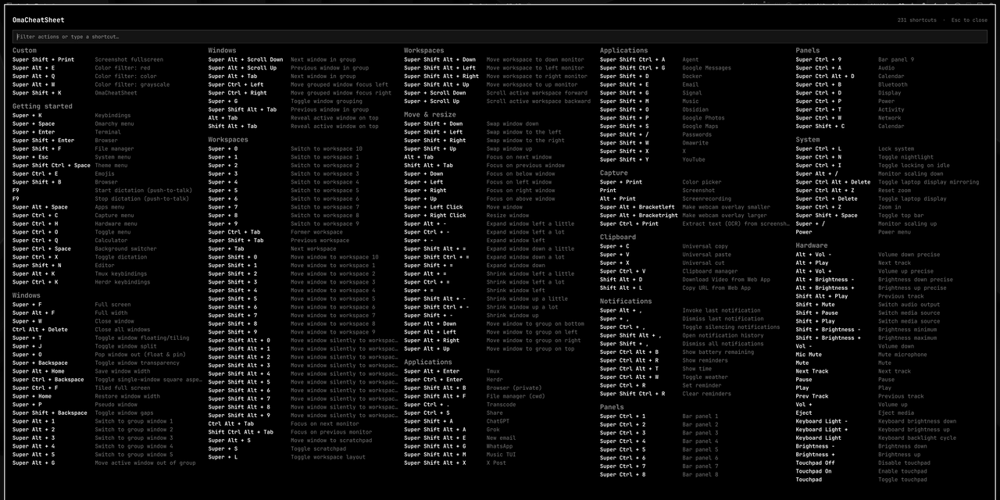

# OmaCheatSheet



A fullscreen, read-only cheat sheet of the live Hyprland/Omarchy keybindings.
Click the bar icon (or summon the overlay) to see every current shortcut,
grouped into columns. The list is rebuilt from the running compositor each
time the overlay opens, so user changes in `~/.config/hypr/bindings.lua`
show up without editing this plugin.

This is a learning surface, not a launcher. Super+K remains the searchable
menu that can dispatch a binding. The suggested overlay shortcut is
**Super+Shift+K** — add it in `~/.config/hypr/bindings.lua`:

```lua
o.bind("SUPER + SHIFT + K", "OmaCheatSheet", "omarchy-shell shell toggle jo.omacheatsheet")
```

## Install

From a published git remote:

```sh
omarchy plugin add <git-url> --enable --yes
```

For local development, symlink the repo into the user plugin directory:

```sh
mkdir -p "$HOME/.config/omarchy/plugins"
ln -sfn "$PWD" "$HOME/.config/omarchy/plugins/jo.omacheatsheet"
omarchy-shell shell rescanPlugins
omarchy plugin enable jo.omacheatsheet
```

The widget lands in the bar's right section by default. Move it with:

```sh
omarchy bar move jo.omacheatsheet --section right
```

Saved changes under the plugin directory reload automatically. If a new file
is not picked up, run `omarchy-shell shell rescanPlugins` again.

## Usage

- Super+Shift+K, or left-click the OCS label on the bar, to open or close the cheat sheet
- Type in the search field to filter by action or shortcut (`screenshot`, `super+k`)
- Press a real chord (for example Super+K) to jump to what that hotkey does
- Press Escape, or click the dimmed margin, to close it
- Open it from a command with `omarchy-shell shell toggle jo.omacheatsheet`

## Remove

```sh
omarchy plugin remove jo.omacheatsheet
```

© 2026 Jay O (@jayosays). Built with Cursor.
